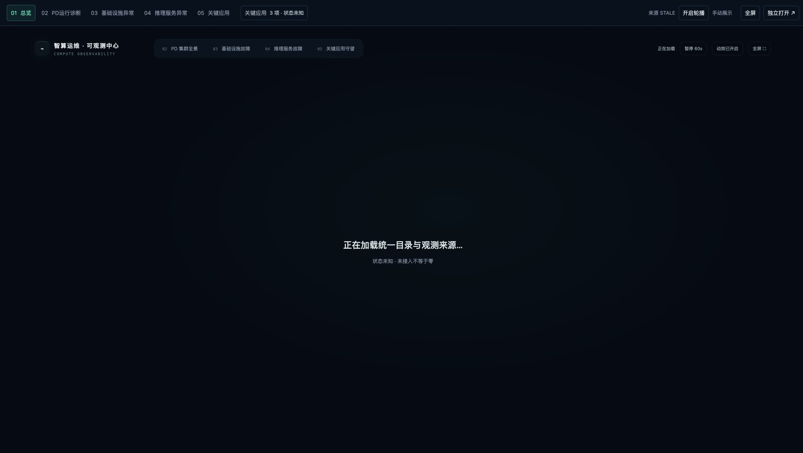

# 智算运维大屏

**Intelligent Compute Ops Dashboard**：面向智算集群的五屏观测界面、AI Gateway 资源控制台、整项推理服务录入与历史独立原型。

静态 HTML / CSS / JavaScript 前端，Django 后端；本地使用 SQLite，K8s 默认通过 NAS PV/PVC 持久化 SQLite，Compose 保留 PostgreSQL。无需前端构建步骤。



*截图为离线演示目录，过期指标保持空值；中心连线表示登记部署关系。*

## 主要界面

| 页面 | 用途 |
| --- | --- |
| 01 全局运维总览 | 单设备原始指标；按实际目录关系显示集群 → 服务 → Endpoint，支持分页和详情下钻 |
| 02 P/D 运行诊断 | 多集群、多 P/D 的 Endpoint 性能与负载查看 |
| 03 基础设施异常定位 | 基础设施异常资源定位；未接入时保留状态说明与留白 |
| 04 推理服务异常定位 | 按 Endpoint 原始状态查看服务与配置业务依赖 |
| 05 关键应用守望 | 关键业务与服务目录关系 |
| AI Gateway Console | 团队、业务、模型、服务、授权引用与运行成员目录 |
| 手动监控数据导入 | 按集群导入推理与硬件 CSV 快照，用于尚未接通巡检的演示 |

目录关系不代表真实调用、运行健康或网络流量。未接入、未知与过期状态单独显示，不用零值替代缺失数据。没有真实采集器时，离线样本明确标记为演示、未验证或过期。

## 本地启动

需要 Python 3.10+；Node.js 用于前端单元测试。

```bash
git clone https://github.com/underthedeepsea/intelligent-compute-ops-dashboard.git
cd intelligent-compute-ops-dashboard
python3 -m venv .venv
source .venv/bin/activate
python -m pip install -r requirements.lock
export CONTROL_LOCAL=1
python backend/manage.py migrate --noinput
python backend/manage.py runserver 127.0.0.1:8767 --noreload
```

- 五屏入口：<http://127.0.0.1:8767/screen/>
- 控制台：<http://127.0.0.1:8767/gateway/>

初始数据库为空，直接在控制台「资源录入」录入完整服务，或在「监控数据管理」录入监控配置与 CSV 快照。无需创建用户、填写账号密码或初始化角色。

当前项目不提供账号、登录、角色或环境授权体系；可直接查看和修改已登记数据，后续生产系统接入另行处理。旧身份表和历史审计仅为数据库兼容保留。原 `demo/local_preview/` 身份初始化脚本作为历史参考保留，不作为当前启动步骤。当前访问契约见 [直接访问设计](docs/direct-access-design.md)。

## 完整推理服务录入与修改

打开 `/gateway/?view=catalog`。侧栏只有一个「资源录入」入口，页内区分「直接录入」「批量导入」「已录入服务目录」，数据保存到后台数据库。

1. 填写推理服务名与PRD/DR/STG/DEV环境；团队、业务、模型、K8s集群可选择已有资源或在同页新建。
2. 选择合并部署或P/D分离，添加P、D及可选Router实例；每个实例填写Namespace、LWS/Deployment、工作负载名、服务地址和多个配置Node。
3. 一次保存整个服务。UUID与内部代码自动生成；不录入动态Pod名称、Pod UID、Node UID或采样时间。配置Node只表示部署登记，不会被当作运行观测。
4. 在已录入服务目录搜索并整项编辑，支持多个P/D组；移除已有实例会退休原记录并保留历史观测。可查看该服务关联图及导出完整JSON。
5. 批量录入下载服务CSV模板，一行一个实例，同service_alias组成一个服务；校验、修正后一次应用全批。批量入口用于创建，已有服务修改走目录。

网关总览保留原完整映射表，并显示实际登记关联图；`/gateway/?view=mapping` 可直接打开图形映射。服务配置CSV与监控指标CSV入口分开，完整JSON导出与配置复制CSV用途不同。操作说明见 [资源录入](docs/catalog-entry.md)。

## 手动监控数据导入

在大屏顶部或控制台侧栏点击「手动数据导入」，也可打开 `/gateway/?view=manual-import`。

1. 选择已登记的目标集群，显式启用 CSV 来源。切换后该集群展示人工快照；没有快照的指标显示缺失。
2. 选择推理指标或硬件指标，下载模板。推理模板预填该集群已有实例编码，时间和指标留空。
3. 填写后上传、校验预览、确认导入。每次替换该集群同一类快照，另一类独立保留。
4. 返回五屏查看 CSV 快照及原始采样时间。

CSV 数值不表示实时巡检或当前健康；系统对象 UUID 无需手工填写。详细字段、单位和错误恢复步骤见 [监控数据说明](docs/monitoring.md)。

## 独立录入原型（实验功能）

```bash
python3 -m http.server 8789 --bind 127.0.0.1 --directory prototypes/gateway-entry-flow
```

访问 <http://127.0.0.1:8789/?mode=wizard>。支持整项服务录入、P/D 与 Router、K8s 命名空间、LWS/Deployment、多个配置 Node、自动生成记录 UUID。数据仅保存在该浏览器，不与正式后端或五屏自动同步；Pod 和采集 UID 不接受人工填入。

**已知未解决事项**：批量导入的显式名称引用可能与导入别名冲突；同页重复载入完整示例可能复用已保存 UUID。暂不将该原型的批量导入用于重要数据。这两项不属于本轮01拓扑调整。

## Docker 与 Kubernetes 部署

API/Web 分别构建为独立镜像，包含前端和 CSV 模板。镜像构建命令、NAS 配置与完整安装顺序见 [中文部署说明](deploy/README.md)。

推荐使用 **HTTP + Web Pod IP:8080 + NAS PV/PVC + SQLite**：`deploy/k8s/http`。无需 Ingress、HTTPS、管理员账号或密码 Secret。API 为单副本、一个 sync worker，采用 Recreate 升级；巡检 worker 默认不部署。迁移、命令行导入、备份和恢复须停止 API，等待所有写者退出后串行执行。保留 CSRF 同源请求校验、数据关联校验和版本冲突检查。

生产仍需 Django 随机应用密钥、实际 Host/HTTP origin、NAS 地址/目录及镜像仓库；应用密钥用于框架签名，不是登录密码。NAS 目录需允许 UID/GID 10001 写入。DELETE/FULL 不能替代目标 NAS 的锁及持久性验收；本地测试不代表真实 K8s/NAS 或 AMD64 成品已验收。准备项见 [生产清单](docs/deployment-production-checklist.md)。

### v0.2 / v0.3 的「尚未获得访问身份」提示

旧版本的页面强制要求登录会话；v0.2 还固定使用 Secure Cookie，普通 HTTP 无法维持该会话。**v0.4.0 已取消项目内鉴权，不能靠配置旧镜像消除该提示。**

从本仓库 v0.4.1 源码构建匹配的 Linux AMD64 API/Web 镜像，按 [升级步骤](deploy/README.md) 停止 API、备份原数据库、串行迁移（确认 `control.0006_endpoint_deployment_configuration` 为已应用），再启动同版本 API 和 Web。无需删除数据库、创建账号或执行 `bootstrap_access`。浏览器刷新后确认 `service-entry.js?v=service-entry-visual-v3` 已加载，并检查 `/api/v1/session` 返回 `access_mode: "direct"`；该兼容路径只提供访问元数据和 CSRF，不建立登录会话。

本次只发布源码、tag 和 release，未上传容器镜像。不要继续运行0.2.0/0.3.0镜像，也不要把本地 ARM 镜像用于 x86 服务器。

## 测试

```bash
node --test frontend/screen/tests/*.test.cjs frontend/gateway/tests/*.test.cjs
node --test prototypes/gateway-entry-flow/directory-core.test.cjs
CONTROL_LOCAL=1 python backend/manage.py test tests --verbosity 1
```

测试包含合成数据与隔离数据库，不构成生产采集验证。历史本机浏览器验收脚本、会话记录、数据库及凭据不随源码发布。

## 项目结构

```text
backend/                 Django API、目录、观测投影与测试
frontend/screen/         五屏与门户
frontend/gateway/        AI Gateway 控制台
prototypes/gateway-entry-flow/  浏览器本地录入原型
demo/local_preview/      历史离线演示参考
contracts/               接口与来源契约
templates/               CSV 模板
deploy/                  镜像构建 / Compose / K8s NAS PV/PVC 部署配置
docs/                    目录录入、监控与上线检查说明
```

项目尚未宣称完成真实巡检平台接入或生产上线；请按来源契约和部署检查项验证自己的环境。

## v0.4.1 录入页更新

资源录入已统一为 Gateway 的白灰橙配色，采用紧凑资料网格、业务关联行与部署实例网格。配置节点支持多个 Node：空配置默认收起，已有节点默认展开。直接录入、批量导入及已录入服务目录的字段和操作保持完整。

本次为展示更新，没有新增数据库迁移。v0.4.0 已完成 `control.0006_endpoint_deployment_configuration` 的部署可按原停写升级流程更新同版本 API/Web 镜像；由更早版本升级仍须执行既有迁移步骤。页面加载后确认 `service-entry.css` 与 `service-entry.js` 均使用 `v=service-entry-visual-v3`。本地 16 项原有单元测试、隔离数据库保存／编辑验收和独立审查通过；生产 NAS/K8s 与 Linux AMD64 镜像仍需现场验收。
